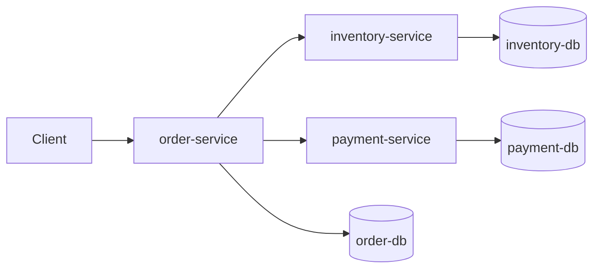

# Order Processing Platform (Java + Spring Boot)

Starter microservices project for a backend portfolio case study.

## Outcome

- Built 3 independent backend services (`order`, `inventory`, `payment`) with JWT-secured APIs.
- Implemented service-to-service orchestration for order processing with failure-safe status transitions.
- Added consistent response/error envelopes for cleaner client integration.

## Architecture



## Services

- `order-service` (`:8080`): create order, orchestrate inventory + payment, get order status
- `inventory-service` (`:8081`): reserve stock
- `payment-service` (`:8082`): capture payment

Each service has its own PostgreSQL database via Docker Compose.

## Project Structure

- `pom.xml` (parent Maven multi-module)
- `docker-compose.yml` (3 PostgreSQL containers)
- `services/order-service`
- `services/inventory-service`
- `services/payment-service`

## Prerequisites

- Java 21
- Maven 3.9+
- Docker + Docker Compose

## Run Locally

1. Start databases:

```bash
cd order-processing-platform
docker compose up -d
```

2. Start each service in separate terminals:

```bash
cd services/inventory-service
mvn spring-boot:run
```

```bash
cd services/payment-service
mvn spring-boot:run
```

```bash
cd services/order-service
mvn spring-boot:run
```

## Authentication (JWT)

All business APIs are protected. Obtain a token first from any service:

```bash
curl -X POST http://localhost:8080/api/auth/token \
  -H 'Content-Type: application/json' \
  -d '{"username":"alexjoy","password":"change-me"}'
```

Copy `data.accessToken` from the response and export it:

```bash
export TOKEN="<paste-access-token>"
```

## First Endpoints

### 1) Create an order

```bash
curl -X POST http://localhost:8080/api/orders \
  -H "Authorization: Bearer $TOKEN" \
  -H 'Content-Type: application/json' \
  -d '{
    "productCode": "JAVA-BOOK",
    "quantity": 2,
    "amount": 499.00
  }'
```

### 2) Get order status

```bash
curl -H "Authorization: Bearer $TOKEN" http://localhost:8080/api/orders/1
```

### 3) Reserve inventory directly

```bash
curl -X POST http://localhost:8081/api/inventory/reserve \
  -H "Authorization: Bearer $TOKEN" \
  -H 'Content-Type: application/json' \
  -d '{"productCode":"SPRING-COURSE","quantity":1}'
```

### 4) Capture payment directly

```bash
curl -X POST http://localhost:8082/api/payments/capture \
  -H "Authorization: Bearer $TOKEN" \
  -H 'Content-Type: application/json' \
  -d '{"orderId": 101, "amount": 999.00}'
```

### Sample response (`POST /api/orders`)

```json
{
  "timestamp": "2026-03-11T01:10:20+05:30",
  "status": 201,
  "message": "Order created",
  "path": "/api/orders",
  "data": {
    "id": 1,
    "productCode": "JAVA-BOOK",
    "quantity": 2,
    "amount": 499.0,
    "status": "COMPLETED"
  }
}
```

## Suggested Next Improvements

- Add Kafka/RabbitMQ for async order events
- Implement idempotency key support for create order
- Add Testcontainers integration tests
- Add OpenAPI docs and GitHub Actions CI

## Deploy (Render)

This repo includes `render.yaml` + Dockerfiles for service deployment.

1. Connect this repository in Render using Blueprint deploy.
2. Provision all services + databases from `render.yaml`.
3. Set the same `JWT_SECRET` value in all three services.
4. Update `INVENTORY_BASE_URL` and `PAYMENT_BASE_URL` in `order-service` to deployed URLs.
